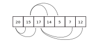

# I. Introduction - définition
## Utilisation des arbres

 - Arbres syntaxiques
 - Arbre lexicographique
 - Arbre de décision / classification (ML)
 - Compression de données
 - Expressions mathématiques

## Classification
```{.mermaid format=pdf}
graph TD;
b(Structures de données) --> s(séquentielles)
b --> h(hierarchiques)
b --> r(relationnels)

s --> l1(listes<br/>piles<br/>files<br/>dictionnaires<br/>sérialisation)
h --> l2(arbres<br/>files de priorités)
r --> l3(graphs)
```

## Définitions


Un arbre (enraciné) est

 - soit un ensemble vide
 - soit un ensemble fini non vide $A$ muni d'une relation binaire $<$ (est le fils de ...) telle que
  - il existe $r \in A$ tel que $\forall x \in A, r < x$ (il existe un ancêtre)
  - $\forall x \in A \setminus \{r\}, \exists ! y \in A, x < y$ (il y a un père unique)
  - $\forall x \in A \setminus \{r\}, \exists n \in \mathbb{N} \text{ et } (x_1, x_2, \ldots, x_n) \in A^n, x < x_1 < x_2 < \cdots < x_n < r$ (chaque élément descend de l'ancêtre)

On parle aussi de frères, de descendance et d'ancêtres.

L'*arité* d'un père correspond au nombre de ses fils

```{.mermaid format=pdf}
graph TD;

r[racine] --- n1[nœud interne]
r --- n2([feuille])
n1 --- f1([feuille])
n1 --- f2([feuille])
n1 --- f3([feuille])
```

Un *arbre $n$-aire* est un arbre dont les nœuds sont d'arité maximale $n$
Dans l'exemple, chaque nœud a au maximum une arité de 3 donc l'arbre est un arbre ternaire.

La *taille* de l'arbre est le nombre de nœuds qui le compose. Dans l'exemple, la taille est 6.

La *profondeur* d'un nœud est:

- -1 si l'arbre est vide
- 0 pour la racine
- le nombre de nœuds depuis la racine avant d'atteindre le nœud

```{.mermaid format=pdf}
graph TD;

r(( )) --- a(( ))
r --- b(( ))

a --- c(( ))
a --- d(( ))
a --- e(( ))

b --- f((N))
f --- g(( ))
f --- h(( ))
```

Par exemple, le nœud $N$ a une profondeur de 2.

La *hauteur* de l'arbre est la profondeur maximale de ses feuilles. Dans l'exemple, la hauteur est de 3.

## Définition inductive

Soit $A$ un ensemble fini appelé nœuds.

- les arbres de hauteur 0 sont les éléments de $A$ noté $(e,0)$ où $e$ est la racine de l'arbre
- Si $e \in A$ et Si $A_1, A_2, \ldots, A_n$ sont des arbres de hauteur respectives $h_1, h_2, \ldots, h_n$ et dont les racines respectives sont $e_1, e_2, \ldots, e_n$, alors en connectant $e$ à $e_1, e_2, \ldots e_n$, on définit $\big(e, (A_1, A_2, \ldots, A_n)\big)$ l'arbre de racine $e$, de hauteur $\displaystyle 1 + \max_{k \in [\![ 1,n ]\!]} (h_k)$ de sous arbres $A_1, A_2, \ldots, A_n$

```{.mermaid format=pdf}
graph TD;

e((e)) --- e1((e1))
e --- e2((e2))
e --- e3((e3))

linkStyle 0 stroke:red;
linkStyle 1 stroke:red;
linkStyle 2 stroke:red;

subgraph A1
e1
end

subgraph A2
e2 --- e2_1(( ))
e2 --- e2_2(( ))
end

subgraph A3
e3 --- e3_1(( ))
e3 --- e3_2(( ))
e3 --- e3_3(( ))
end
```

## Remarques:

Arbre marqué: Chaque nœud associé à une étiquette / valeur

Arbre non marqué: Les nœuds n'ont pas de valeurs associés

Un arbre est un graph:

- Simple: pas de boucles ou d'arêtes multiples
- Non orienté: les parcours $a \to b$ et $b \to a$ sont toujours possible
- Acyclique: pas de "boucles"
- Connexe: tous les nœuds sont accessibles


### Propriété:

Pour un arbre de hauteur $h$ d'arité $a>1$, le nombre $n$ de nœuds vérifie
$$ h + 1 \geqslant n \geqslant \frac{a^{h+1} - 1}{a - 1} $$

### Preuve:

Le nombre minimal de nœuds pour une hauteur donnée est un arbre contenant 1 nœud par hauteur. 
Le nombre maximal de nœuds pour une hauteur donnée est un arbre contenant $i$ nœud par niveau $i$.

\begin{align*}
	&\sum_{i=0}^h 1 \geqslant n \geqslant \sum_{i=0}^h a^i\\
	\iff& h + 1 \geqslant n \geqslant \frac{a^{h+1}-1}{a-1}
\end{align*}

# II. Arbres particuliers

## Définitions

### Arbres binaires: 

Tous les nœuds sont d'arité au maximum 2.

```{.mermaid format=pdf}
graph TD;

a(( )) --- b(( ))
a --- c(( ))

b --- d(( ))
b --- e(( ))

linkStyle 3 stroke:white;
style e fill:none;

c --- f(( ))
c --- g(( ))

g --- h(( ))
g --- i(( ))
```

### Arbre binaire entier:

Tous les nœuds sont d'arité 2

```{.mermaid format=pdf}
graph TD;

a(( )) --- b(( ))
a --- c(( ))

b --- e(( ))
b --- f(( ))

c --- g(( ))
c --- h(( ))

e --- i(( ))
e --- j(( ))
```

### Arbre binaire complet
Arbre binaire dont les feuilles ont toutes la même profondeur. Il possède le nombre maximal de feuilles pour une hauteur donnée. On parle donc de fils gauche et de fils droit.

```{.mermaid format=pdf}
graph TD;

a(( )) --- b(( ))
a --- c(( ))

b --- e(( ))
b --- f(( ))

c --- g(( ))
c --- h(( ))

e --- i(( ))
e --- j(( ))

f --- k(( ))
f --- l(( ))

g --- m(( ))
g --- n(( ))

h --- o(( ))
h --- p(( ))
```

## Propriétés

Nombre de nœuds $n \leqslant 2^p$ (pour un niveau $p$)

Hauteur $h$: $\lfloor \log_2(n) \rfloor < h \leqslant n - 1$

Arbre binaire à $i$ nœuds interne (et la racine) d'arité 2 et $f$ feuilles : $f = i + 1$

Nombre de feuilles $f \leqslant 2^h$

Profondeur maximale d'un arbre d'arité $a$ composée de $n$ nœuds: $$\log_a\big((a-1)\times n + 1\big) - 1 \leqslant h \leqslant n-1$$

### Remarque:

\begin{align*}
	&\log_a((a-1)\times n + 1)  - 1 \le h\\
	\implies& \log_a((a-1)\times n) < \log_a ((a-1) \times n + 1) \le h+1\\
	\implies& \left\lfloor \log_a((a-1)\times n) \right\rfloor< h+1\\
	\implies&\left\lfloor \log_a((a-1)\times n) \right\rfloor \le h
\end{align*}

soit $\left\lfloor \log_a((a-1)\times n) \right\rfloor\le h \le  n-1$

## Transformation d'un arbre en arbre binaire

Algorithme de transformation d'un arbre $n$-aire $A$ en arbre binaire:

\tt
	Pour chaque $e \in A$\\
		Laisser $e_g$ (fils le plus à gauche) en place\\
		Supprimer les autres fils de $e$ et les chainer à $e_g$\\
		Le nœud $e_d$ est le prochain frère de $e$\\
	Fin pour
\rm

```{.mermaid format=pdf}
graph TD;
a --- b
a --- c
a --- d
a --- e

b --- f
b --- g
e --- h
e --- i
e --- j
```

```{.mermaid format=pdf}
graph TD;
a --- b
a --- c
a --- d
a --- e

b --- f
f --- g
e --- h
e --- i
e --- j
```

```{.mermaid format=pdf}
graph TD;
a --- b
a --- d
a --- e

b --- f
b --- c

f --- m1([vide])
f --- g

e --- h
e --- i
e --- j
```

```{.mermaid format=pdf}
graph TD;
a --- b
a --- e

b --- f
b --- c

f --- m1([vide])
f --- g
c --- m2([vide])
c --- d

e --- h
e --- i
e --- j
```

```{.mermaid format=pdf}
graph TD;
a --- b
a --- m0([vide])

b --- f
b --- c

f --- m1([vide])
f --- g
c --- m2([vide])
c --- d

d --- m3([vide])
d --- e

e --- h
e --- i
e --- j
```

```{.mermaid format=pdf}
graph TD;
a --- b
a --- m0([vide])

b --- f
b --- c

f --- m1([vide])
f --- g
c --- m2([vide])
c --- d

d --- m3([vide])
d --- e

e --- h
e --- i
h --- m4([vide])
h --- j
```

```{.mermaid format=pdf}
graph TD;
a --- b
a --- m0([vide])

b --- f
b --- c

f --- m1([vide])
f --- g
c --- m2([vide])
c --- d

d --- m3([vide])
d --- e

e --- h
e --- m4([vide])

h --- m5([vide])
h --- j

j --- m6([vide])
j --- i
```

Exercice:


```{.mermaid format=pdf}
graph TD;

a --- b
a --- c
a --- d
a --- e
a --- f
a --- g

b --- h
b --- i
b --- j

e --- k
e --- l

g --- m

k --- p
l --- q

h --- n
h --- o
```

```{.mermaid format=pdf}
graph TD;

a --- b
b --- h
h --- n
n --- m1([vide])
n --- o
h --- i
i --- m2([vide])
i --- j
b --- c
c --- m3([vide])
c --- d
d --- m4([vide])
d --- e
e --- k
k --- p
k --- l
l --- q
l --- m5([vide])
e --- f
f --- m6([vide])
f --- g
g --- m
g --- m7([vide])
a --- m8([vide])
```

## Arbres binaires : implémentation sous forme de tableau en C (sérialisation)

On stocke un arbre binaire dans un tableau d'enregistrements
Chaque enregistrement E est défini par:

 - E.clé : valeur du nœud
 - E.gauche : indice du fils gauche dans le tableau
 - E.droit : indice du fils droit dans le tableau

Une valeur de E.gauche ou E.droit égale à -1 indique qu'il n'existe pas de fils.

+-------------------------+-----+-----+----+-----+-----+------+------+------+------+------+ 
|  Indice dans le tableau |  0  |  1  |  2 |  3  |  4  |   5  |   6  |   7  |   8  |   9  | 
+-------------------------+-----+-----+----+-----+-----+------+------+------+------+------+ 
|  Clé                    |  23 |  2  |  3 |  5  |  7  |  11  |  13  |  37  |  41  |  19  | 
+-------------------------+-----+-----+----+-----+-----+------+------+------+------+------+ 
|  Gauche                 |  -1 |  5  |  3 | -1  | -1  |   9  |  -1  |   8  |   6  |  -1  | 
+-------------------------+-----+-----+----+-----+-----+------+------+------+------+------+ 
|  Droit                  | -1  |  4  |  0 | -1  | -1  |  -1  |   2  |   1  |  -1  |  -1  | 
+-------------------------+-----+-----+----+-----+-----+------+------+------+------+------+ 

1. Représenter cet arbre. Est-il binaire ? Entier ? Complet ? 

	```{.mermaid format=pdf}
	graph TD;

	1 --- 5
	1 --- 4
	2 --- 3
	2 --- 0
	5 --- 9
	5 --- a([vide])
	6 --- b([vide])
	6 --- 2
	7 --- 8
	7 --- 1
	8 --- 6
	8 --- c([vide])
	```

	C'est un arbre binaire mais il n'est pas complet ni entier.

2. Définir le code en C permettant de définir ce tableau (statique)

	```c
		typedef struct item {
			int val;
			int left;
			int right;
		};

		item table[10]; 
	```

3. Écrire une fonction en C qui renvoie l'enregistrement de la racine

	```c
		int getRoot(item* table, int len, item* root) {
			for(int i = 0; i < len; i++) {
				for(int j = 0; j < len; j++) {
					// on vérifie si i est un fils de j
					if(table[j].left == i || table[j].right == i) {
						break; // nouvelle itération de la boucle exterieure
					}
				}

				return i;
			}

			// pas de racine, il y a une boucle
			return -1;
		}
	```

	Solution:

	```c
		item getRoot(item* table) {
			int search[10] = {0};

			for(int i = 0; i < 10; i++) {
				if(table[i].left != -1) {
					search[table[i].left] = 1;
				}

				if(table[i].right != -1) {
					search[table[i].right] = 1;
				}
			}

			for(int i = 0; i < 10; i++) {
				if(search[i] == 0)
					return table[i];
			}
		}
	```

	Solution 2:

	```c
		item getRoot(item* table, int len) {
			int root = 0;

			for(int i = 0; i < len; i++) {
				root += i;

				if(table[i].left != -1) {
					root -= table[i].left;
				}

				if(table[i].right != -1) {
					root -= table[i].right;
				}
			}

			return table[root];
		}
	```

4. Écrire une fonction en C qui affiche la valeur de toutes les feuilles de T

	```c
		void showValues(item* table, int len) {
			item root;
			int rootIndex = getRoot(table, len, &root);

			showChildValues(rootIndex, table);
		}

		void showChildValues(int index, item* table) {
			item val = table[index];

			if(val.left == -1 && val.right == -1) {
				printf("%d\n", val.val);
			}

			if(val.left != -1) 
				showChildValues(val.left, table);

			if(val.right != -1) 
				showChildValues(val.right, table);
		}
	```

	Solution:

	```c
	void showValues(item* table, int len) {
		for(int i = 0; i < len; i++) {

			// uniquement vrai si gauche = droite = -1
			if(table[i].left == table[i].right) {
				printf("%d", table[i].val);
			}
		}
	}
	```

## Arbres binaires de recherche

Arbre binaire marqué:

  - Présence d'une étiquette pour chaque nœud $x$ de A

  - Étiquettes

    - Même type
    - Présence d'une clé appartenant à un ensemble $E$
    - Relation d'ordre total sur $E$
    - Notation $x.\mathrm{clé}$

Organisation de l'arbre binaire de recherche: soit un nœud $x$ de $A$.

  - Alors toutes les étiquettes des nœuds $y$ des sous arbres gauches de $x$ sont telles que $y.\mathrm{clé} \leqslant x.\mathrm{clé}$

  - Et toutes les étiquettes des nœuds $y$ des sous arbres droits de $x$ sont telles que $y.\mathrm{clé} \geqslant x.\mathrm{clé}$

Exemples:

```{.mermaid format=pdf}
graph TD;

r(5) --- a(3)
r --- b(7)

subgraph <= racine.cle = 5
a --- c(2)
a --- d(4)
end

b --- m((vide))
b --- e(8)
```


```{.mermaid format=pdf}
graph TD;

r(2) --- m1((vide))
r --- a(5)
a --- b(7)
a --- m2((vide))
subgraph >= x.cle = 5
b --- c(6)
b --- d(8)
c --- e(5)
c --- m3((vide))
d --- m4((vide))
d --- f(10)
end
```


Nœud:

- Étiquette
  - clé
  - information
- Fils gauche
- Fils droit

Opérations fondamentales des ABR:

- Constructeur
- Accesseurs
  - Recherche d'une clé
  - Rechercher le minimum
  - Rechercher le maximum
  - Rechercher un successeur
  - Rechercher un prédécesseur
- Transformateurs
  - Insérer un nœud
  - Supprimer un nœud

Utilité: faciliter une recherche avec une recherche par clé dans l'ABR

 - temps de recherche proportionnel à la hauteur $h$ de l'arbre
   - $T(n) = \mathcal{O}(n)$ recherche linéaire dans le pire des cas (liste chainée)
   - $T(n) = \mathcal{O}\big(\log_2(n)\big)$ recherche en temps logarithmique en moyenne pour un ABR complet.
 - Dépend de la construction de l'arbre:

```{.mermaid format=pdf}
graph TD;
a(5) --- b(3)
a --- c(7)
b --- d(2)
b --- e(4)
c --- m((vide))
c --- f(8)
```

6 nœuds, hauteur 2 : Efficace

```{.mermaid format=pdf}
graph TD;

r(2) --- m1((vide))
r --- a(5)
a --- m2((vide))
a --- b(7)
b --- c(6)
b --- d(8)
c --- e(5)
c --- m3((vide))
d --- m4((vide))
d --- f(10)
```

6 nœuds, hauteur 4 : Peu efficace

L'efficacité augment quand la hauteur diminue.

Arbre dégénéré (filiforme) : chaque nœud n'a qu'un enfant.

## Arbres binaires bicolores (rouge - noir)

Arbre de recherche: possibilité d'arbre déséquilibré (filiforme, dégénéré)

 - Recherche en $\mathcal{O}(n)$ où $n$ est le nombre de nœuds
 - aucun apport par rapport à une liste chainée

Arbre bicolore: arbre de recherche particulier, approximativement équilibré

 - Recherche en $\Theta\big(\log_2(n)\big)$

Arbre binaire bicolore $\to$ marqué

 - présence d'une étiquette pour chaque nœud $x$ de $A$
 - Fils gauche, fils droit
 - Étiquettes
   - même type
   - clé
   - information
   - information supplémentaire : *couleur* (1 bit)

Propriétés rouge noir:

  - chaque nœud est soit rouge, soit noir
  - chaque feuille est noire
  - la racine est noire
  - si un nœud est rouge, ses deux enfants sont noirs
  - pour chaque nœud, tous les chemins simples reliant le nœud à des feuilles situées plus bas dans l'arbre contiennent le même nombre de nœuds noirs

Remarque:

 - Ajout de nœuds noirs vide (pointeur sur NIL) pour générer les feuilles
 - Informations contenues dans les nœuds internes

Exemple:

Les nœuds rouges sont entre $[ ]$ et les nœuds noirs entre $\langle \rangle$

```{.mermaid format=pdf}
graph TD;

r{{26}} --- a(17)
r --- b{{41}}

a --- c{{14}}
a --- d{{21}}
b --- e(30)
b --- f{{47}}

c --- g(10)
c --- h{{16}}
d --- i{{19}}
d --- j{{23}}
e --- k{{28}}
e --- l{{38}}
f --- m1{{NIL}}
f --- m2{{NIL}}

g --- m{{7}}
g --- n{{12}}
h --- o(15)
h --- m3{{NIL}}
i --- m4{{NIL}}
i --- p(20)
j --- m5{{NIL}}
j --- m6{{NIL}}
k --- m7{{NIL}}
k --- m8{{NIL}}
l --- q(35)
l --- s(39)

m --- t(3)
m --- m9{{NIL}}
n --- m10{{NIL}}
n --- m11{{NIL}}
o --- m12{{NIL}}
o --- m13{{NIL}}
p --- m14{{NIL}}
p --- m15{{NIL}}
q --- m16{{NIL}}
q --- m17{{NIL}}
s --- m18{{NIL}}
s --- m19{{NIL}}
t --- m20{{NIL}}
t --- m21{{NIL}}
```

```{.mermaid format=pdf}
graph TD;

r --- m0{{T.NIL}}
r{{26}} --- a(17)
r --- b{{41}}

a --- c{{14}}
a --- d{{21}}
b --- e(30)
b --- f{{47}}

c --- g(10)
c --- h{{16}}
d --- i{{19}}
d --- j{{23}}
e --- k{{28}}
e --- l{{38}}
f --- m0
f --- m0

g --- m{{7}}
g --- n{{12}}
h --- o(15)
h --- m0
i --- m0
i --- p(20)
j --- m0
j --- m0
k --- m0
k --- m0
l --- q(35)
l --- s(39)

m --- t(3)
m --- m0
n --- m0
n --- m0
o --- m0
o --- m0
p --- m0
p --- m0
q --- m0
q --- m0
s --- m0
s --- m0
t --- m0
t --- m0
```

T.NIL : sentinelle

 - Simplification des conditions aux limites
 - Même attributs qu'un nœud ordinaire:
    - Valeur: noir
    - Autres attributs: valeurs quelconques
 - Aussi parent de la racine

Hauteur noire omise


```{.mermaid format=pdf}
graph TD;

r{{26}} --- a(17)
r --- b{{41}}

a --- c{{14}}
a --- d{{21}}
b --- e(30)
b --- f{{47}}

c --- g(10)
c --- h{{16}}
d --- i{{19}}
d --- j{{23}}
e --- k{{28}}
e --- l{{38}}

g --- m{{7}}
g --- n{{12}}
h --- o(15)
i --- p(20)
l --- q(35)
l --- s(39)

m --- t(3)
```

Propriété rouge - noire : la longueur $L$ d'un chemin allant de la racine à une feuille est comprise entre $h_n$ et $2h_n$.

Chemin: suite de nœuds dont chacun est le prédécesseur ou le successeur du suivant.

$h_n$ étant la profondeur noire de l'arbre.

**Justification:**

Si tous les nœuds sont noirs, alors $h_n$ est égale à la profondeur de l'arbre.

S'il y a systématiquement une alternance entre nœuds rouges et noirs, alors la hauteur totale $h$ de l'arbre vaut $2h_n$

Exercice 1:

 - Arbre 1 : non (rouge $\to$ rouge)
 - Arbre 2 : non (racine rouge)
 - Arbre 3 : non (nombre de nœuds noirs $\neq$)
 - Arbre 4 : non (n'est pas un ABR car 10 < 22)

Exercice 2:

```{.mermaid format=pdf}
graph TD;
r{{30}} --- a(15)
r --- b{{40}}
a --- c{{10}}
a --- d{{25}}
c --- n1((N))
c --- n2((N))
d --- f(20)
d --- n5((N))
f --- n3((N))
f --- n4((N))
b --- n6((N))
b --- e(50)
e --- n7((N))
e --- n8((N))
```

Exercice 3:

```{.mermaid format=pdf}
graph TD;
r{{30}} --- a(20) --- b{{10}} --- c{{3}} --- n0((N))
c --- n1((N))
b --- d{{15}} --- n2((N))
d --- n3((N))
a --- e{{25}} --- f{{21}} --- n4((N))
f --- n5((N))
e --- g{{28}} --- n6((N))
g --- n7((N))
r --- h{{40}} --- i(35) --- j{{32}} --- n8((N))
j --- n9((N))
i --- k{{37}} --- n10((N))
k --- n11((N))
h --- l{{50}} --- n12((N))
l --- n13((N))
```

 1. hauteurs $h_n(30) = 3$, $h_n(20) = 3$, $h_n(35) = 2$ et $h_n(50) = 1$
 2. Dans le meilleur des cas, il n'y a pas de nœuds rouges, donc $h = h_n$ et donc le nombre de feuille $f$ vaut $2^h$ donc $2^{h_n(x)}$. Or, le nombre de nœuds internes $i$ valide $f = i + 1$ donc $i = f - 1$ et donc $i \geqslant 2^{h_n(x)} - 1$
 3. Dans le meilleur des cas, on a $h = h_n$.
 	\begin{align*}
		i \geqslant 2^{h_n(x)} - 1 \iff&
		i + 1 \geqslant 2^{h_n(x)}\\ \iff&
		\log_2(i+1) \geqslant h_n(x) = h
	\end{align*}

# III. Parcours d'arbres

## Définition

Soit un arbre $A$ de taille $n$.

Objectif:

  - visiter les nœuds pour traitement
  - contrainte: chaque nœud doit être traité une seule fois

Définition:

Un parcours d'arbre est une succession de nœuds $(n_1, n_2, \ldots, n_n)$, indiquant l'ordre dans lequel ils ont été visités

Pricipe général des parcours d'arbre :

- marquage du nœud après sont traitement pour ne plus le traiter
- maintien d'un ensemble de nœuds en attente de traitement

Existence de plusieurs manières de parcourir un arbre

## Utilisation des arbres

Arbres d'expression $\to$ représentation d'expressions

 - Arbre syntaxique
 - Expressions mathématiques

Arbres préfixes (ou trie) $\to$ représentation d'un ensemble de mots

$$ %FAIRE LE GRAPH
$$


## Parcours en profondeur

### Définitions

Principe de parcours en profondeur:

 - Utilisation de la définition inductive des arbres
 - Proposition d'algorithmes récursifs

$\implies$ Exploration d'un des sous-arbres avant d'explorer le sous-arbre suivant

Plusieurs posibilités:

- Exploration en partant de la racine
- Exploration en partant des feuilles
- Exploration symétrique

Remarque: Le choix de traiter de gauche à doite est arbitraire.

Ordre préfixé:

 - Départ à la racine
 - Exploration préfixe du sous-arbre gauche
 - Exploration préfixe du sous-arbre droit
 - $\vdots$
 - Exploration du sous-arbre $A_n$

Pour un arbre binaire, ordre = père, fils gauche, fils droit.

Pour l'arbre ci-dessous, l'ordre préfixé est
$$
a \to b \to e \to h \to i \to f \to c \to d \to g \to j \to k \to o \to p \to q \to l \to m \to n
$$

```{.mermaid format=pdf}
graph TD;
a --- b --- e --- h
e --- i
b --- f
a --- c
a --- d --- g ---j
g --- k --- o
k --- p
k --- q
g --- l
g --- m
g --- n
```

Ordre infixé ou parcours symétrique:

 - Exploration infixé du sous-arbre gauche
 - Puis racine
 - Exploration infixé du sous-arbre droit
 - $\vdots$
 - Exploration des nœuds de $A_n$ en ordre infixé

Pour un arbre binaire, ordre : fils gauche, père, fils droit.

Pour un ABR : ordre infixé

 - Obtention de la suite ordonnée des étiquettes

Pour l'arbre précédent, l'ordre infixé est
\begin{align*}
h \to e \to i \to b \to f \to a \to c \to j \to g \to o \to k \to p \to q \to l \to m \to n \to d
\end{align*}


Ordre postfixé:

 - Exploration postfixé du sous-arbre gauche
 - Exploration postfixé du sous-arbre droit
 - $\vdots$
 - Exploration du sous-arbre $A_n$
 - Traitement de la racine

Pour une arbre binaire, l'ordre est fils gauche, fils droit, père

Parcours en profondeur de l'arbre précédent : 
\begin{align*}
	h \to i \to e \to f \to b \to c \to j \to o \to p \to q \to k \to l \to m \to n \to g \to d \to a
\end{align*}

## Parcours en profondeur : arbre d'expression

Problème lié aux expressions infixes : gestion des parenthèses

$\left(1 + 2 \times \sqrt3\right) / 4$ pour $\frac{1 + 2\sqrt3}4$

Représentation d'une expression sous forme d'arbre : 

```{.mermaid format=pdf}
graph TD;
a("÷") --- b(+) --- c(1)
b --- d("×") --- e(2)
d --- f("√") --- g(3)
a --- h(4)
```

Parcours de l'arbre : 

 - Infixe : $(1~+~(2~\times~\sqrt{3}))~/~4$
 - Préfixe : $/~(+~1~(\times~2~\sqrt3))~4$
 - Postfixe : $(1~(2~(3~\sqrt{~})~\times)~+)~4~/$

Notation polonaise inversée (NPI):

 - Notation postfixé
 - Nécessité de deux piles :
    - pile d'expression
    - pile de calcul

$\frac{9}{(2 + (-3)) \times (4 - (-5))}$

```{.mermaid format=pdf}
graph TD;
a("÷") --- o(9)
a --- b("×") --- c(+) --- p(2)
c --- d("-") --- r(3)
b --- e("-") --- q(4)
e --- f("-") --- s(5)
```

Infixe : $9~\div~(~(2~+~(-3)~)~\times~(4~-~(-5)~)~)$

Préfixe : $\div~9~(\times~~(~+~2~(-~3)~)~(~-~4~(-~5)~)~)$

Postfixe : $9~(~(~2~(3~-)~+~)~(~4~(5~-)~-~)~\times~)~\div$

+----------+---+---+---+-------+-------+------+------+-------+------+----------+--------+------+
| Etape    | 1 | 2 | 3 | 4     | 5     | 6    | 7    | 8     |  9   | 10       | 11     | 12   |
+:--------:+:-:+:-:+:-:+:-----:+:-----:+:----:+:----:+:-----:+:----:+:--------:+:------:+:----:+
| Mot lu   | 9 | 2 | 3 | neg   | $+$   | 4    | 5    | neg   |  $-$ | $\times$ | $\div$ |      |
+----------+---+---+---+-------+-------+------+------+-------+------+----------+--------+------+
| Pile     | 9 | 2 | 3 | $-3$  | $-1$  | $-1$ | 5    | $-5$  |  9   |    $-9$  | $-9$   | $-1$ |
+----------+---+---+---+-------+-------+------+------+-------+------+----------+--------+------+
|          |   | 9 | 2 |  2    | 9     | 9    | 4    |  4    | $-1$ |      9   |  9     |      |
+----------+---+---+---+-------+-------+------+------+-------+------+----------+--------+------+
|          |   |   | 9 |  9    |       |      | $-1$ | $-1$  |  9   |          |        |      |
+----------+---+---+---+-------+-------+------+------+-------+------+----------+--------+------+
|          |   |   | 9 |  9    |       |      |      |  9    |      |          |        |      |
+----------+---+---+---+-------+-------+------+------+-------+------+----------+--------+------+

Parcours de l'arbre $\to$ utilisation d'une pile

Visite des fils droits avant les fils gauches pour retrouver l'ordre préfixe (fils gauche en somme de pile)

Pile : 

+---+---+
| 1 |   |
+---+---+
| 3 | 2 |
+---+---+
| 3 | 4 |
+---+---+
| 3 |   |
+---+---+
| 6 | 5 |
+---+---+
| 6 | 7 |
+---+---+
| 6 |   |
+---+---+

Clés traité: $1\to2\to4\to3\to5\to7\to6$

```{.mermaid format=pdf}
graph TD;
r((1)) --- a((2)) --- b((4))
r --- c((3)) --- d((5)) --- e((7))
c --- f((6))
```

### Bilan

Parcours d'un arbre $\to$ fonction récursive

Comportement d'une pile

Depth First Search (DFS)

```
Fonction ParcoursArbre(Élément)
  Entrée: pointeur sur un nœud de l'arbre
  Sortie: traitement sur chacun des nœuds du sous-arbre enraciné en un élément
  Début
    Si Élément != NIL Alors
      Traitement Élément     != parcours préfixé
      Parcours arbre.gauche
      Traitement Élément     != parcours infixé
      Parcours arbre.droit
      Traitement Élément     != parcours postfixé
    Fin Si
  Fin
```

## Parcours en largeur

Principe du parcours en largeur :

 - Départ de la racine
 - Exploration des nœuds par niveaux de l'arbre
 - Pour un même niveau, parcours de gauche à droite

$\implies$ Parcours réalisé à l'aide d'une file

Visite des fils gauches avant les fils droits

Parcours intéressant pour

 - une recherche avec la plus petite profondeur possible
 - pour une énumération

```{.mermaid format=pdf}
graph TD;
r((1)) --- a((2)) --- b((4))
r --- c((3)) --- d((5)) --- e((7))
c --- f((6))
```

File:

+---+---+---+
| 1 |   |   |
+---+---+---+
| 3 | 2 |   |
+---+---+---+
| 4 | 3 |   |
+---+---+---+
| 6 | 5 | 4 |
+---+---+---+
| 6 | 5 |   |
+---+---+---+
| 7 | 6 |   |
+---+---+---+
| 7 |   |   |
+---+---+---+


Clés traitées: $1\to 2\to 3\to 4\to 5\to 6\to 7$

# IV. Implémentation

## Arbres binaires de recherche

Type arbre n'existe pas $\to$ sérialisation (stockage sous un autre format)

Deux implémentations possibles : 

 1. Par tableaux (voir exercice)
 2. Par enregistrement et pointeurs

Solution par enregistrement:

 - Création du type nœud
 - Creation du type arbre pointant sur la racine de l'arbre (en C)
 - Arbre complet contenu dans un enregistrement d'enregistrements (en OCAML)

>> $\implies$ structure récursive

Quels champs pour un nœud ?

 - entier `clé`
 - pointeur `fils_gauche`
 - pointeur `fils_droit`
 - pointeur `parent`
 - enregistrement `informations`

En C, nécessité d'écrire une fonction créant un nœud :

 - Entrée:
   * valeur (`int`)
   * info (enregistrement contenu dans le nœud)
 - Sortie:
   * pointeur sur le nœud créé (les champs `fils_gauche`, `fils_droit` et `parent` sont initialisé à `NULL`)

Constructeur : créer un arbre

 - Entrée : aucun
 - Sortie : pointeur sur la racine, qui peut être `NULL`/`NIL`
 - Sémantique :
   * Fonction créant un pointeur sur la racine
   * Pointeur sur la racine initialisé à `NULL`/`NIL`

Transformateur : insérer un nouveau nœud $\to$ nouvelle feuille. Plusieurs cas à envisager :

 * Arbre vide $\to$ insérer au niveau de la racine
 * Arbre non vide

    - Début de la racine
    - Parcours de l'arbre par chemin descendant à la recherche d'un `NULL`/`NIL`
    - Pointeur sur nœud, descendant l'arbre jusqu'à `NIL` (pointeur de traine)
    - Mise à jour du parent de nouveau
    - Mise à jour du fils gauche / droit du futur parent
    - Nécessité d'un pointeur temporaire conservant l'adresse du futur parent
    - Mise à jour dans la boucle du pointeur sur parent

>> $\implies$ Deux phases :

>>> 1. Recherche de la feuille
>>> 2. Modification de l'arbre / mise à jours des nœuds

> Cette fonction est linéaire en temps : $\mathcal{O}(h)$ où $h$ est la hauteur de l'arbre.

Transformateur : Supprimer un nœud

 - Argument : pointeur sur l'arbre, valeur de la clé
 - Retourne : arbre modifié
 - Sémantique : ?

> Quel cas envisager ? 

>> Il faut vérifier que la clé est présent dans l'arbre

>> Suppression d'une feuille

>> Suppression d'un nœud interne / racine ayant un seul enfant

>> Suppression d'un nœud interne / racine ayant deux enfants

- Suppression d'une feuille : modification du parent et suppression de la feuille
- Suppression d'un nœud interne / racine ayant un seul enfant

  * modification du parent (Parent.gauche ou Parent.doit pointe sur l'enfant non nul du nœud supprimé)
  * modification de l'enfant (Enfant.parent pointe sur le parent du nœud supprimé)

- Suppression d'un nœud interne / racine ayant deux enfants

  * Enfant droit est le *successeur* (la définition est après) du nœud à supprimer
  * Enfant droit devient le fils de Parent à la place du nœud à supprimer: mise à jour de Parent.gauche et de Enfant droit.parent
  * Enfant gauche devient le fils gauche de Enfant droit : mise à jours de Enfant droit.gauche et Enfant gauche.parent

Prédécesseurs et successeurs : Si toutes les clés sont distinctes, le successeur d'un nœud $x$ est le nœud $y$ possédant la plus petite clé supérieure à $x$.clé

Les algorithmes sont sur la feuille "Structures hiérarchiques --- Arbres" mais uniquement pour information : on n'a pas à savoir les écrire.

## Arbre bicolore

Modification du type : ajout d'un champ pour désigner la couleur

Opérations d'insertion et de suppression :

> $\to$ visite des nœuds pour préserver les propriétés des arbres bicolores

\large\sc Non Traité \normalsize\rm (aucune indication dans le programme)

## Équilibrage des arbres (arbres binaires de recherche)

Préservation des propriétés de l'arbre binaire de recherche

Utile pour équilibrage des arbres

> $\to$ se rapprocher d'un arbre entier

> $\to$ éviter les arbres filiformes (car la recherche est en $\mathcal{O}(n)$)

Arbre H-équilibré:

> Déséquilibre d'un arbre en $a$ : $$
\mathrm{déséquilibre}(a) = h\big(\mathrm{gauche}(a)\big) - h\big(\mathrm{droit}(a)\big)
$$

> Un arbre $a$ est H-équilibré si, pour tous ses sous--arbres $b$ on a : $$
\mathrm{déséquilibre}(b)\in\{-1,0,1\}
$$

> Un arbre AVL (Adelson -- Velskii -- Landis en 1962) est un arbre H-équilibré.

Arbre initial : 

```{.mermaid format=pdf}
graph TD;
x --- A
x --- y --- B
y --- C
```


Après une rotation gauche, on a

```{.mermaid format=pdf}
graph TD;
y --- x --- A
x --- B
y --- C
```

Après une rotation droite, on retrouve l'arbre initial.

Rotation gauche : $x$ va à droite

Rotation droite : $y$ va à gauche

Exercice 1 : 

1. Arbre $A_1$
	a. $\mathrm{déséquilibre}(A_1) = 3 - 3 = 0$, il est donc H-équilibré
	b.

		```{.mermaid format=pdf}
		graph TD;
		a((12)) --- b((3)) --- d((2)) --- h[N]
		d --- i[N]
		b --- e((5)) --- j[N]
		e --- k[N]
		a --- c((14)) --- f[N]
		c --- g((15)) --- l[N]
		g --- m[N]
		```


		Après une rotation à droite de centre le nœud $3$ : 

		```{.mermaid format=pdf}
		graph TD;
		a((12)) --- b((2)) --- d[N]
		b --- e((3)) --- h[N]
		e --- i((5)) --- j[N]
		i --- k[N]
		a --- c((14)) --- f[N]
		c --- g((15)) --- l[N]
		g --- m[N]
		```

		Après la rotation à gauche de centre le nœud $14$ : 

		```{.mermaid format=pdf}
		graph TD;
		a((12)) --- b((2)) --- d[N]
		b --- e((3)) --- h[N]
		e --- i((5)) --- j[N]
		i --- k[N]
		a --- c((15)) --- g((14))
		c --- l[N]
		g --- m[N]
		g --- f[N]
		```

	2. Arbre $A_2$

		a. $\mathrm{déséquilibre}(A_2) = 0$
		b. Rotation à gauche de centre $5$ puis à droite de centre $14$


# V. Tas et files de priorité

## Tas : définition

Un tas est un arbre binaire :

- tel que (condition sur le squelette) :
	toutes les feuilles sont de profondeur $h$ ou $h - 1$.
	Pour toute profondeur $p < h$, il y a exactement $2^p$ nœuds.
	Toutes les feuilles (de profondeur $h$) sont le plus à gauche de l'arbre
- tournoi (condition sur les étiquettes) :
	l'étiquette d'un nœud est supérieure (inférieure) ou égale à celles de ses fils

Tas max : l'étiquette d'un nœud est supérieure ou égale à celles de ses fils.

Tas min : l'étiquette d'un nœud est inférieure ou égale à celles de ses fils.

Structure bin adaptée pour gérer les files de priorité :

> implémentation : (priorité, élément)

> la priorité sert de clé

Exercice : construire 3 tas max contenant les nœuds de clés $\{8, 10, 14, 15, 16, 17, 20\}$

```{.mermaid format=pdf}
graph TD;
r((20)) --- a((17)) --- b((15))
a --- c((14))
r --- d((16)) --- e((8))
d --- f((10))
```

```{.mermaid format=pdf}
graph TD;
r((20)) --- a((17)) --- b((16))
a --- c((15))
r --- d((14)) --- e((10))
d --- f((8))
```

```{.mermaid format=pdf}
graph TD;
r((20)) --- a((17)) --- b((16))
a --- c((8))
r --- d((15)) --- e((14))
d --- f((10))
```

## Implémentation des tas

Implémentation dans un tableau :

* Chaque nœud correspond à un élément du tableau
* Fils gauche d'un nœud $i$ stocké à l'indice $2i$
* Fils droit d'un nœud $i$ stocké à l'indice $2i + 1$
* Parent d'un nœud $i$ stocké à l'indice $\left\lfloor \frac{i}{2} \right\rfloor$

Tableau $A$ représentant un tas : deux attributs (algorithmique) :

- $A$.longueur : nombre d'éléments dans un tableau,
* $A$.taille : nombre d'éléments dans le tas,
* Le premier élément du tableau $A$ est la racine du tas,
* On a $A$.longueur $\leqslant$ $A$.taille.

Possibilités :

* Stocker la taille du tas à l'indice 0 du tableau lors de la programmation,
* Définir un enregistrement contenant la taille du tas et le tableau.




Exercice 2:

1. Au maximum, on a un arbre complet de hauteur $h$ donc $2^{h+1} - 1$ nœuds.
   Au minimum, on a un arbre complet de hauteur $h - 1$ et le nœud le plus à gauche à un fils gauche. On a donc au minimum $2^h$ nœuds.
2.
```{.mermaid format=pdf}
graph TD;
a((23)) --- b((17)) --- d((6)) --- h((5))
d --- i((7))
b --- e((13)) --- j((12))
a --- c((14)) --- f((10))
c --- g((1))
```

> Cet arbre n'est pas un tas max car $7 > 6$. Il faut donc enlever 7 et 12 : 
  $$ [\;23, 17, 14, 6, 13, 10, 1, 5\;] $$
  La taille de ce tas est 8.

3. On suppose que le nœud stocké en $\left\lfloor \frac{n}{2} \right\rfloor + 1$ est un parent.
   Alors, son fils gauche est stocké en $2\left(\left\lfloor \frac{n}{2} \right\rfloor + 1\right)$. Or
   $$ \left\lfloor \frac{n}{2} \right\rfloor + 1 > {n \over 2} \iff 2\left(\left\lfloor \frac{n}{2}\right\rfloor + 1\right) > n. $$
   Donc, l'indice étant en dehors du tableau, il n'a pas de fils. C'est donc une feuille.

   Soit $k \in \left[\kern-2mm\left[ 1, \left\lfloor {n \over 2} \right\rfloor\;\; \kern-1mm\right]\kern-2mm\right]$. $k \times 2 \leqslant 2$ donc $k$ a un fils donc ce n'est pas une feuille.

## Opérations sur les tas

Trois opérations

1. Préservation de la propriété des tas max

>> Reçoit un tableau et un indice du tableau

>> Modifie le tableau pour qu'il contienne un tas max

2. Construction d'un tas max

>> Reçoit un tableau

>> Retourne un tas max

3. Tri par tas

>> Tri d'un tableau par ordre croissant (décroissant) en utilisant les propriétés d'un tas max (min).

### Conservation de la propriété des tas max

(code sur la feuille)

*État de l'arbre et du tableau pour l'appel de `entasserMax(A, 2)` avec*
$$\mathit{A = [\;20,15,17,34,5,7,12,10,16\;]\kern3mm \text{\it?}} $$

Après une itération, on a $A = [\;20,34,17,15,5,7,12,10,16\;]$.

Après deux itération, on a $A = [\;20,34,17,16,5,7,12,10,15\;]$.

```{.mermaid format=pdf}
graph TD;
a((20))---b((15))---d((34))---h((10))
d---i((16))
b---e((5))
a---c((17))---f((7))
c---g((12))
```
devient
```{.mermaid format=pdf}
graph TD;
a((20))---b((34))---d((16))---h((10))
d---i((15))
b---e((5))
a---c((17))---f((7))
c---g((12))
```

*Que représente $i$ pour l'arbre résultant ?*

Le $i$ représente l'indice dans le tableau de l'arbre de la racine du tas max que l'on veut former.

Fonction `entasserMax` :

* Reçoit un tableau $A$ représentant un tas,\vspace{-2mm}
* Reçoit un $i$,\vspace{-2mm}
* Retourne $A$ modifié.\vspace{3mm}

* `entasserMax` fait l'hypothèse que les sous arbres gauche et droit du nœud $i$ sont des tais mais que le nœud $i$ est peut être plus petit que ses enfant.\vspace{3mm}

* `entasserMax` fait alors descendre le nœud $i$ jusqu'à ce que la propriété de tas max soit rétablie localement.\vspace{3mm}

* Complexité en $\mathcal{O}(\ln n) = \mathcal{O}(h)$

Fonction `construireTasMax`:

* Construction d'un tas,
* Conversion en tas max,
* Invariant : au début de chaque itération de la boucle pour, chaque nœud $i+1, i+2, \ldots, n$ est la racine d'un tas max,
* Complexité en $T(n) = \mathcal{O}(n\ln n)$.

## Tri par tas (*heap sort*)

On fait remonter la dernière valeur du tableau en l'interchangeant avec la racine du tas (la plus grande valeur). Pour éviter de faire remonter la plus grande valeur à la racine, on diminue la taille du tas. On recrée un tas local en replaçant la valeur maximale à la racine.

Première étape : \vspace{-2mm}

> Construction du tas max \vspace{-2mm}

> La première valeur est la racine donc l'élément de clé la plus grande.

> \vspace{-2mm} On place cet élément en dernier.

Seconde étape : \vspace{-2mm}

> On rétablit la propriété de tas max sur le tableau privé du dernier élément.

Répétition du processus jusqu'à arriver à un tas de taille 2.

Complexité en $\mathcal{O}(n \ln n)$.

## Files de priorité

Exemple d'utilisation très répandue des tas $\to$ gestion de files de priorités

Objectifs : classer des événements par ordre de priorité

Nœuds $\to$ association (priorité, élément)

Existence de files de priorités min et de files de priorités max

Exemple d'utilisation de files de priorités

 * Ordonnancement des tâches
 * Ordinateurs multi threads (programme de spé.)
 * Parcours en largeur de graphs (Dijkstra, $A^*$, Prim, ...)

### Opérations sur les files de priorités

Opérations sur les tas max $\to$ restent accessibles :

* `entasserMax(A, i)`
* `construireTasMax(A)`

Opérations propres aux files max :

* `maximumTas(A)`
* `extraireMaxTas(A)`
* `augmenterCle(A, i, cle)`
* `insererTasMax(A, cle)`

Opération propres aux files min :

* `minimumTas(A)`
* `extraireMinTas(A)`
* `diminuerCle(A, i, cle)`
* `insererTasMin(cle)`

#### Opérations propres aux files de priorité max

* Opération `maximumTax(A)` : \vspace{-2mm}

>> Entrée : tableau `A` \vspace{-2mm}

>> Sortie : élément de priorité maximale \vspace{-2mm}

>> Sémantique : \vspace{-2mm}

>>> Retourne $-1$ si le tas est vide \vspace{-2mm}

>>> Retourne la racine sinon \vspace{-2mm}

>>> Ne supprime pas les éléments du tas \vspace{-2mm}

* Opération `extraireMaxTas(A)` : \vspace{-2mm}

>> Entrée : tableau `A` \vspace{-2mm}

>> Sortie : élément de priorité maximale, tableau modifié \vspace{-2mm}

>> Sémantique : \vspace{-2mm}

>>> Retourne $-1$ si le tas est vide \vspace{-2mm}

>>> Retourne la racine et le tableau modifié sinon \vspace{-2mm}

>>> Supprime l'élément du tas\vspace{-2mm}

>>> Reconstitue la propriété de tas max\vspace{-2mm}


* Opération `augmenterCle(A, i, cle)` (c.f. feuille)
* Opération `insérerTasMax(A, cle)` (c.f. feuille)


